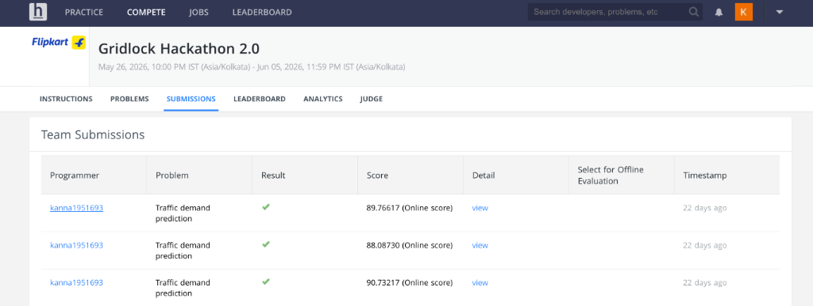

# Flipkart Gridlock Hackathon 2.0: Traffic Demand Forecasting

This repository contains the solution for the **Flipkart Gridlock Hackathon 2.0 - Traffic Demand Prediction** challenge. The goal of this hackathon is to predict traffic demand across different areas (represented by geohashes) and timestamps under various weather and road conditions.

Our approach achieved a top online validation score of **90.73%** using a robust feature engineering pipeline and the **CatBoost Regressor** model.

## Leaderboard Submission Score


---

## Step-by-Step Methodology Flowchart

Below is the step-by-step pipeline of our workflow:

```mermaid
graph TD
    A[Raw Data: train.csv & test.csv] --> B[Data Cleaning & Imputation]
    B --> B1[RoadType & Weather -> Mode Imputation]
    B --> B2[Temperature -> Median Imputation]
    
    B1 & B2 --> C[Feature Engineering]
    
    C --> C1[Time Features]
    C1 --> C1a[hour, minute, time_bin]
    C1 --> C1b[Cyclic: time_sin, time_cos]
    C1 --> C1c[Flags: is_peak, is_night]
    
    C --> C2[Interaction Features]
    C2 --> C2a[road_lane = RoadType + NumberofLanes]
    C2 --> C2b[geo_road = geohash + RoadType]
    
    C --> C3[Safe Aggregation Features]
    C3 --> C3a[geo_mean, day49_geo_mean]
    C3 --> C3b[hour_mean, time_mean]
    C3 --> C3c[geohash_freq]
    
    C1 & C2 & C3 --> D[Training Preparation]
    D --> D1[Set Sample Weights: Day 49 = 3x, Others = 1x]
    D --> D2[Specify Categorical Features for CatBoost]
    
    D1 & D2 --> E[Model Validation]
    E --> E1[80-20 Split & Train CatBoost Regressor]
    E --> E2[Evaluate R2 Score ~0.9536 on Validation]
    
    E2 --> F[Final Training]
    F --> F1[Retrain on Full Dataset with Best Iterations + 100]
    F --> G[Inference & Output]
    G --> G1[Predict on Test & Clip to [0, 1]]
    G1 --> G2[Save submission.csv -> Online Score: 90.73217]
```

---

## Technical Approach & Step-by-Step Process

### 1. Data Cleaning & Imputation
- **Categorical Columns (`RoadType`, `Weather`)**: Replaced missing values using the mode (most frequent value) from the training set to prevent model failure.
- **Numerical Columns (`Temperature`)**: Imputed missing temperature values using the median from the training set, preserving robustness against outliers.

### 2. Feature Engineering & Transformations
Feature engineering is key to capturing the spatio-temporal dynamics of traffic:
- **Cyclical Time Encoding**:
  - Parsed `timestamp` (HH:MM) to `hour` and `minute`.
  - Computed `time_bin` = `hour * 60 + minute` (representing the minutes from the start of the day).
  - Built sine and cosine transforms:
    $$\text{time\_sin} = \sin\left(\frac{2\pi \cdot \text{time\_bin}}{1440}\right)$$
    $$\text{time\_cos} = \cos\left(\frac{2\pi \cdot \text{time\_bin}}{1440}\right)$$
    This helps the model understand that `23:59` is adjacent to `00:00`.
- **Traffic Peak & Night Flags**:
  - `is_peak`: Set to `1` during office rush hours (7:00–9:59 AM, 5:00–7:59 PM), and `0` otherwise.
  - `is_night`: Set to `1` during late-night and early-morning hours (12:00–5:59 AM) when demand is naturally low.
- **Interaction Features**:
  - `road_lane`: Concatenation of `RoadType` and `NumberofLanes` to capture lane capacities under different road types.
  - `geo_road`: Concatenation of `geohash` and `RoadType` to capture localized road-type behaviors.
- **Target Aggregation Statistics**:
  - `geo_mean`: Mean target demand per `geohash` across the training set.
  - `day49_geo_mean`: Mean target demand per `geohash` specifically for Day 49 (the final training day), acting as a powerful spatial lag feature.
  - `hour_mean` & `time_mean`: Average traffic demand per hour and per time bin.
  - `geohash_freq`: The frequency count of geohashes in the dataset to act as a proxy for density.

### 3. Model Training Strategy & CatBoost
CatBoost is selected as the primary modeling algorithm due to its robust handling of categorical variables (such as `geohash` and interaction features) and resistance to overfitting:
- **Weighted Training**:
  - Traffic patterns on the last training day (Day 49) are much more representative of the test set patterns. We assigned a **sample weight of 3.0** to all Day 49 instances, and **1.0** to other days.
- **Hyperparameter Configuration**:
  - `depth`: 7
  - `learning_rate`: 0.03
  - `loss_function`: RMSE
  - `early_stopping_rounds`: 150
  - `iterations`: 2000 (tuned via validation)
- **Validation**:
  - Split training data (80% train, 20% validation).
  - Achieved a validation $R^2$ score of **0.9536**.
- **Final Retraining**:
  - Retrained on the entire training set using the best validation iteration count + 100 to maximize performance on test data.
  - Clipped final predictions to the $[0, 1]$ interval to guarantee logical validity of demand scores.

---

## Feature Importances

Here are the top features contributing to the model's performance:

| Rank | Feature Id | Importance (%) | Description |
|---|---|---|---|
| 1 | `geo_mean` | 34.94% | Average historical demand for the geohash |
| 2 | `road_lane` | 19.87% | Interaction of RoadType and NumberofLanes |
| 3 | `day49_geo_mean` | 10.88% | Average demand for the geohash on the last day |
| 4 | `RoadType` | 6.64% | Type of road |
| 5 | `time_mean` | 4.96% | Historical average demand for the specific time bin |
| 6 | `time_cos` | 3.39% | Cosine cyclical time feature |
| 7 | `hour_mean` | 3.26% | Historical average demand for the hour |
| 8 | `time_sin` | 2.85% | Sine cyclical time feature |
| 9 | `day` | 2.11% | Training day number |
| 10 | `time_bin` | 2.04% | Minutes from midnight |

---

## File Structure

```
├── README.md               # Project documentation (this file)
├── model_a.ipynb           # Model development, feature engineering, and inference notebook
├── screenshots/            # Images used in documentation
│   ├── gridlock_hackathon_banner.png
│   └── submissions_score.png
└── LICENSE                 # Project License
```

## How to Run & Reproduce
1. Install requirements:
   ```bash
   pip install pandas numpy catboost scikit-learn
   ```
2. Place the dataset files (`train.csv`, `test.csv`) in the root directory.
3. Open and run the `model_a.ipynb` Jupyter notebook.
4. The final predictions will be exported to `submission.csv`.